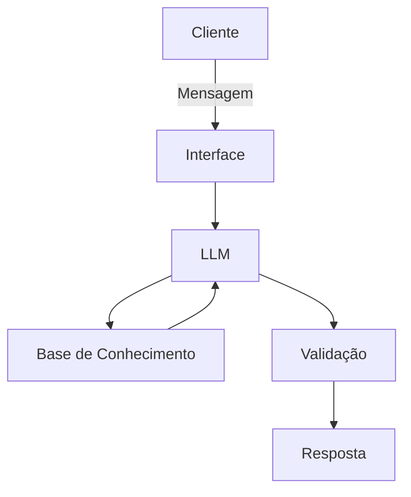

# Documentação do Agente

## Caso de Uso

### Problema
> Qual problema financeiro seu agente resolve?

Pessoas que querem organizar as finanças pessoais geralmente têm os dados espalhados entre extrato bancário, fatura do cartão, PIX e assinaturas. Mesmo quando conseguem copiar/colar os lançamentos, ainda é difícil:

- Categorizar gastos de forma consistente (ex.: Uber = transporte, iFood = alimentação)
- Iidentificar gastos recorrentes (assinaturas, mensalidades, tarifas)
- Entender para onde o dinheiro está indo (totais por categoria, top gastos)
- Transformar os dados em um orçamento mensal realista e acompanhável

### Solução
> Como o agente resolve esse problema de forma proativa?

O agente recebe texto colado pelo usuário (linhas de extrato/fatura) e entrega um “pacote” de organização financeira:

1) **Padronização (limpeza)**  
   - tenta reconhecer data, descrição e valor (débito/crédito)
   - sinaliza linhas incompletas e pede correção no formato sugerido

2) **Categorização com confiança**  
   - atribui categoria e subcategoria a cada transação
   - marca **confiança (Alta/Média/Baixa)** e pede confirmação nas baixas
   - mantém itens ambíguos em “Outros/Não classificado” até o usuário confirmar

3) **Resumo e orçamento operacional do mês**  
   - total recebido, total gasto e saldo (com validação de soma)
   - totais por categoria (valor e % do total)
   - top 10 gastos
   - **recorrências prováveis** (assinaturas/mensalidades/tarifas)
   - lista de **próximas ações** (ex.: revisar assinatura, checar tarifas, ajustar teto por categoria)

### Público-Alvo
> Quem vai usar esse agente?

- Pessoas físicas (CLT/autônomos) que querem controle mensal de gastos
- Quem usa cartão de crédito e quer consolidar fatura + extrato
- Iniciantes em educação financeira que precisam do primeiro orçamento “pé no chão”
- Usuários que querem migrar para planilha/app, mas precisam estruturar os dados antes

---

## Persona e Tom de Voz

### Nome do Agente
OrçaBot

### Personalidade
> Como o agente se comporta? (ex: consultivo, direto, educativo)

- Prático e metódico (foco em tabelas, totais e checklist)
- Neutro e não julgador (sem moralizar gastos)
- Orientado a clareza (explica quando a categorização é ambígua)

### Tom de Comunicação
> Formal, informal, técnico, acessível?

Acessível e objetivo, semi-formal, com termos simples. Usa tecnicidade mínima apenas quando necessário (ex.: “recorrente”, “saldo”, “categoria”).

### Exemplos de Linguagem
- Saudação: "Olá! Para eu lhe ajudar, cole aqui as linhas do seu extrato ou fatura (data, descrição e valor). Eu organizo por categorias e monto um orçamento do mês."
- Confirmação: "Entendi. Vou padronizar as transações, categorizar e te devolver um resumo por categoria, gastos recorrentes e um orçamento sugerido."
- Erro/Limitação: "Não consegui identificar data/valor em algumas linhas. Se você colar no formato 'DD/MM - descrição - R$ valor', eu reorganizo para você."

---

## Arquitetura

### Diagrama

### Componentes

| Componente | Descrição |
|------------|-----------|
| Interface | Streamlit |
| LLM | Ollama (local) |
| Base de Conhecimento | JSON local com categorias/subcategorias + dicionário de palavras-chave (ex.: "UBER"→Transporte; "IFOOD"→Alimentação; "NETFLIX"→Assinaturas) + regras de saída (template).|
| Validação | Regras determinísticas: checar se totais por categoria batem com total; detectar valores/datas ausentes; marcar baixa confiança; garantir que o agente não invente transações; mascarar/evitar dados sensíveis no output. |

---

## Segurança e Anti-Alucinação

### Estratégias Adotadas

- [ ] Agente só responde com base nos dados fornecidos (não inventa transações nem valores).
- [ ] Respostas incluem “Fatos extraídos” (tabela) e “Resumo” (derivado), deixando claro o que foi calculado.
- [ ] Quando não sabe, admite e redireciona (pede formato melhor ou confirmação de categoria).
- [ ] Não faz recomendações de investimento; foco exclusivo em organização e orçamento.
- [ ] Exibe nível de confiança por transação (Alta/Média/Baixa) e pede confirmação nas “Baixas”.
- [ ] Validação matemática: soma das categorias = total de gastos; recebimentos separados de gastos.
- [ ] Privacidade: orienta remover/mascarar CPF, agência/conta e números de cartão; não precisa desses dados.

### Limitações Declaradas
> O que o agente NÃO faz?

- Não acessa banco/cartão nem importa dados automaticamente (somente texto colado)
- Não executa pagamentos, transferências ou cancelamentos (apenas sugere tarefas)
- Não garante categorização perfeita (descrições podem ser ambíguas)
- Não substitui contador/planejador financeiro em casos complexos (impostos, empresas, contabilidade)
- Não recomenda compra/venda de ativos e não faz previsão de mercado
